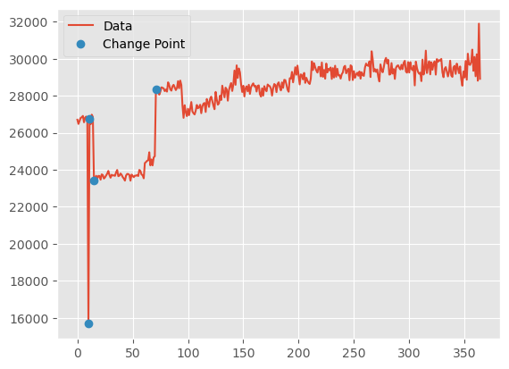

# Change Point Detection
## Overview
Otava implements a nonparametric change point detection algorithm designed to identify statistically significant distribution changes in time-ordered data. The method is primarily based on the **E-Divisive family of algorithms** for multivariate change point detection, with some practical adaptations.

At a high level, the algorithm:
- Measures statistical divergence between segments of a time series
- Searches for change points using hierarchical segmentation
- Evaluates significance of candidate splits using statistical hypothesis testing

The current implementation prioritizes:
- Robustness to noisy real-world signals
- Deterministic behavior
- Practical runtime for production workloads

A representative example of algorithm application:

Here the algorithm detected 4 change points with statistical test showing that behavior of the time series changes at them. In other words, data have different distribution to the left and to the right of each change point.

## Technical Details
### Main Idea
The main idea is to use a divergence measure between distributions to identify potential points in time series at which the characteristics of the time series changed. Namely, having a time series $$Z_1, \cdots, Z_T$$ (which may be multidimensional, i.e. from $$\mathbb{R}^d$$ with $$d\geq1$$) we are testing subsequences $$X_\tau = \{ Z_1, Z_2, \cdots, Z_\tau \}$$ and $$Y_\tau(\kappa)=\{ Z_{\tau+1}, Z_{\tau+2}, \cdots, Z_\kappa \}$$ for all possible $$1 \leq \tau < \kappa \leq T$$ to find such $$\hat{\tau}, \hat{\kappa}$$ (called candidates) that maximize the probability that $$X_\tau$$ and $$Y_\tau(\kappa)$$ come from different distributions. If the probability for the best found $$\hat{\tau}, \hat{\kappa}$$ is above a certain threshold, then candidate $$\hat{\tau}$$ is a change point. The process is repeated recursively to the left and to right of $$\hat{\tau}$$ until no candidate corresponds to a high enough probability. This process yields a series of change points $$0 < \hat{\tau}_1 < \hat{\tau}_2 < \cdots < \hat{\tau}_k < T$$.

### Original Work
The original work was presented in [*"A Nonparametric Approach for Multiple Change Point Analysis of Multivariate Data" by Matteson and James*](https://arxiv.org/abs/1306.4933). The authors provided extensive theoretical reasoning on using the following empirical divergence measure:

$$\hat{\mathcal{Q}}(X_\tau,Y_\tau(\kappa);\alpha)=\dfrac{\tau(\kappa - \tau)}{\kappa}\hat{\mathcal{E}}(X_\tau,Y_\tau(\kappa);\alpha),$$

$$\hat{\mathcal{E}}(X_\tau,Y_\tau(\kappa);\alpha)=\dfrac{2}{\tau(\kappa - \tau)}\sum\limits_{i=1}^\tau\sum\limits_{j=\tau+1}^\kappa \|X_i - Y_j\|^\alpha - {\displaystyle \binom{\tau}{2}^{-1}} \sum\limits_{1\leq i < j \leq\tau}\|X_i - X_j\|^\alpha - {\displaystyle \binom{\kappa - \tau}{2}^{-1}} \sum\limits_{\tau+1\leq i < j \leq\kappa}\|Y_i - Y_j\|^\alpha,$$

where $$\alpha \in (0, 2)$$, usually we take $$\alpha=1$$; $$\|\cdot\|$$ is Euclidean distance; and the coefficient in front of the second and third terms in $$\hat{\mathcal{E}}$$ are binomial coefficients.
The candidates are given by the

$$(\hat{\tau}, \hat{\kappa}) = \text{arg}\max\limits_{(\tau, \kappa)}\hat{\mathcal{Q}}(X_\tau,Y_\tau(\kappa);\alpha).$$

After the candidates are found, one needs to find the probability that $$X_{\hat{\tau}}$$ and $$Y_{\hat{\tau}}(\hat{\kappa})$$ come from a different distribution. Generally speaking, the time sub-series $$X$$ and $$Y$$ could come from any distribution(s), and authors proposed the use of a non-parametric permutation test to test for significant difference between them. If the candidates are shown to be significant, the process is to be run using hierarchical segmentation, i.e., recursively. For more details read the linked paper.

### Hunter Paper
While the original paper was theoretically sound, there were a few practical issues with the methodology. They were outlined pretty well in [*Hunter: Using Change Point Detection to Hunt for Performance Regressions by Fleming et al.*](https://arxiv.org/abs/2301.03034). Here is the short outline, with more details in the linked paper:
- High computational cost due to the permutation significance test
- Non-deterministicity of the results due to the permutation significance test
- Missing change points in some of the patterns as the time series expands.

The authors proposed a few innovations to resolve the issues. Namely,
1. **Faster significance test:** replace permutation test with Student's t-test, that demonstrated great results in practice - *This helps resolve computational cost and non-deterministicity*.
2. **Fixed-Sized Windows:** Instead of looking at the whole time series, the algorithm traverses it through an overlapping sliding window approach - *This helps catch special pattern-cases described in the paper*.
3. **Weak Change Points:** Having two significance thresholds. Algorithm starts with a more relaxed threshold to find "weak" change points, and then continues by re-evaluating all "weak" change points using stricter threshold to yield the final change points - *Using a single threshold could have myopically stopped the algorithm. Allowing it to look for more points and filter out the "weak" ones later resolves the issue.*

### Otava Implementation
The current implementation in Apache Otava is effectively the one from Hunter paper with an in-house implementation of the algorithm.

Starting with a zero-indexed time series $$X_0, X_1, \cdots, X_{T-1}$$, we are interested in computing $$\hat{\mathcal{Q}}(X_\tau,Y_\tau(\kappa);\alpha)$$. Moreover, because we are going to recursively split the time series, the series in the arguments of the function $$\mathcal{Q}$$ do not have to start from the beginning of the series. For simplicity, let us fix $$\alpha=1$$ and define the following function instead:

$$Q(s, \tau, \kappa) = \left.\mathcal{Q}(\{X_s, X_{s+1}, \dots, X_{\tau-1}\}, 
\{X_\tau, X_{\tau + 1}, \cdots, X_\kappa\}; \alpha)\right|_{\alpha=1},$$

which is equivalent to comparing the time series slices `X[s:tau]` and `X[tau:kappa]` in Python notation. Next, let us define a symmetric distance matrix $$D$$, with $$D_{ij} = \|X_i - X_j\|$$ and the following auxiliary functions:

$$V(s, \tau, \kappa) = \sum\limits_{i=s}^{\tau-1} D_{i\tau},$$

$$H(s, \tau, \kappa) = \sum\limits_{j=\tau}^{\kappa-1} D_{\tau j}.$$

Note that $$V(s, \tau, \kappa) = V(s, \tau, \cdot)$$ and $$H(s, \tau, \kappa) = H(\cdot, \tau, \kappa)$$.
Finally, we can use function $$V$$ and $$H$$ to define recurrence equations for $$Q$$. We start by rewriting the function $$Q$$ as a sum of three functions:

$$Q(s, \tau, \kappa) = A(s, \tau, \kappa) - B(s, \tau, \kappa) - C(s, \tau, \kappa),$$

Here, functions $$A$$, $$B$$, $$C$$ correspond to cross-series distances, left series distances and right series distances, respectively. See **[Original Work](#original-work)** section for function definitions.

$$A(s, \tau, \kappa) = A(s, \tau - 1, \kappa) - \dfrac{2}{\kappa - s} V(s, \tau - 1, \kappa) + \dfrac{2}{\kappa - s} H(s, \tau - 1, \kappa),$$

$$B(s, \tau, \kappa) = \dfrac{2(\kappa - \tau)}{(\kappa - s)(\tau - s - 1)} \left(\dfrac{(\kappa - s)(\tau - s - 2)}{2 (\kappa - \tau + 1)} B(s, \tau - 1, \kappa) + V(s, \tau - 1, \kappa) \right),$$

$$C(s, \tau, \kappa) = \dfrac{2(\tau - s)}{(\kappa - s) (\kappa - \tau - 1)} \left( \dfrac{(\kappa - s)(\kappa - \tau - 2)}{2 (\tau + 1 - s)} C(s, \tau + 1, \kappa) - H(s, \tau, \kappa) \right).$$

The starting values are $$A(s, s, \kappa)=0$$, and $$B(s, s, \kappa)=0$$, and $$C(s, \kappa, \kappa)=0.$$ Note that functions $$A$$ and $$B$$ are computed as $$\tau$$ increases, and function $$C$$ is computed as $$\tau$$ decreases.

These formulas are effectively used in Apache Otava after some numpy vectorizations. For details see `change_point_divisive/calculator.py`.
